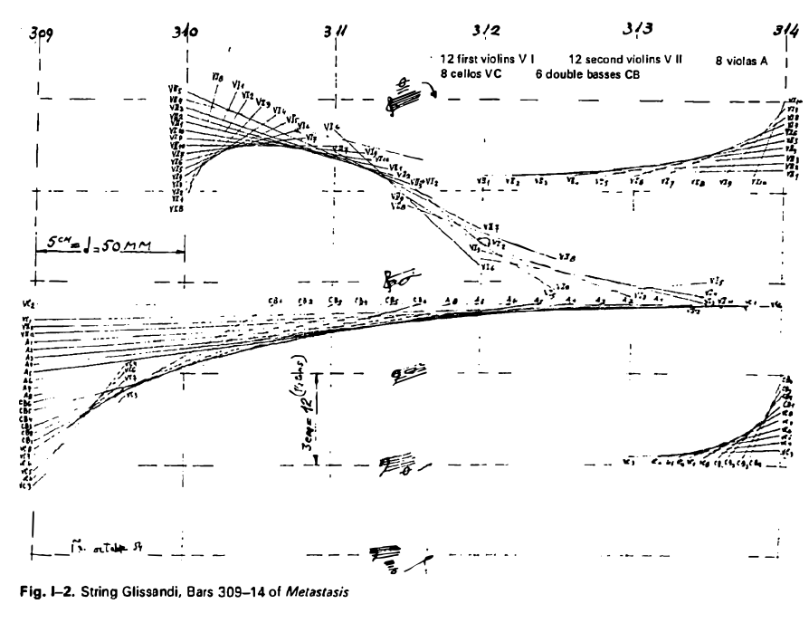

<!-- _class: lead -->
# What is algorithmic composition?



--- 

# What is an algorithm?

An algorithm is a process that takes something as an input, computes on it, and then outputs the result.

---

"A recipe is a good example of an algorithm because says what must be done, step by step. 
It takes inputs (ingredients) and produces an output (the completed dish)." - from Wikipedia

---

In music, we can crudely think of the input as _parameters_ and the output as _sound_

---

# When composing with algorithms ...

... We define the _conditions_ for a composition, rather than the specificities of a composition

---

# Algorithmic time

When writing music using algorithms, you are forced to reconsider compositional time in your work

---

# Algorithmic time: Nonlinearity

The most immediate consequence is an escape\* from the linear timeline we experience in a DAW

\* You can never escape time

---

# Algorithmic time: On the verge

"algorithms are on the verge of time, in so far as they are on the verge between constancy and change, on the one hand, and between concrete and abstract temporality, on the other. " - Julian Rohrhuber, Algorithmic music and the Philosophy of Time

---

# Algorithmic time: SuperCollider and time

[SuperCollider and Time (Ircam)](https://medias.ircam.fr/xb090dd_supercollider-and-time) - A nice technical introduction to SuperCollider's idea of time by the creator of SuperCollider

---

<!-- _class: lead -->
# The SuperCollider pattern library

---

From the [Pattern help file](http://doc.sccode.org/Classes/Pattern.html):

> "[The Pattern] classes form a rich and concise score language for music"

---

# In other words:
Patterns are used to sequence and compose music

---

# It's just data
Easily transpose, stretch and warp the composition

---

# Guides in the help system
Patterns are pretty well documented in the help system:

- [A practical guide](http://doc.sccode.org/Browse.html#Streams-Patterns-Events%3EA-Practical-Guide)
- [Understanding Streams, Events and Patterns](http://doc.sccode.org/Browse.html#Tutorials%3EStreams-Patterns-Events)

---
<!-- _class: lead -->
# Basic building blocks
## Event patterns

---

# What is a (sound) event?

Think of what happens when you press the key of a piano

What data does that involve? 

---

- Duration of key press
- Pitch of the key
- Sustain (are you holding the foot pedal?)
- etc. etc.

---

# What does an Event look like?

Make sure your server is booted before trying this:

```
// See the post window when evaluating these
().play; // Default event
(freq:999).play; 
(freq:123, sustain: 8).play;
```
---

# Changing the default synth
The default synth sucks

You can change it by defining a new synth called \default

More info on [my website](https://madskjeldgaard.dk/how-to-change-the-default-synth-in-supercollider/)

---

# Introducing the allmighty Pbind

Arguably the most important pattern class in SuperCollider

---

# Pbind data

Pbind simply consists of a list of key/value pairs

---

# Keys correspond to Synth arguments

Most often, keys correspond to a Synth's arguments.

Example: If a SynthDef has the argument cutoff, we can access that argument in a Pbind using \cutoff.

---

# Some keys are special

---

# dur

\dur is used in most SynthDefs to specify the duration of a note/event.

Make sure this key never gets the value 0.

---

# stretch

\stretch is used to stretch or shrink the timing of a Pbind

---

# When does a Pbind end?

If one of the keys of a Pbind are supplied with a fixed length value pattern, the one running out of values first, will make the Pbind end.

---

# Live coding: Pdef
Live coding patterns: Wrap your event pattern (Pbind) in a Pdef:

```
Pdef('myCoolPattern', Pbind(...)).play;
```

---

# What this means
The Pdef has a name 'myCoolPattern' which is a kind of data slot accessible throughout your system

Every time you evaluate this code, it overwrites that data slot (maintaining only one copy)

---

---

<!-- _class: lead -->
# Basic building blocks
## Value patterns

---

# The building blocks of compositions

Basic building blocks:
- List patterns - `Pseq`
- Random value patterns - `Pwhite`, `Pbrown`
- Random sequence patterns - `Pshuf`, `Prand`, etc.
- Rests

---

# List patterns

See [all of them here]( http://doc.sccode.org/Browse.html#Streams-Patterns-Events%3EPatterns%3EList )

---

# Testing value patterns: asStream

You will see the .asStream method a lot in the documentation for value patterns.

```
// Pattern
p = Pseq([1,2,3]);

// Convert to stream
p = p.asStream;

// See what values the pattern produces
p.next; // 1, 2, 3, nil
```

---

# Pseq: Classic sequencer

```
// Play values 1 then 2 then 3
Pseq([1,2,3]);

// 4 to the floor
Pseq([1,1,1,1]);
```
---

# Random value patterns: Pwhite and Pbrown

```
// (Pseudo) random values
Pwhite(lo: 0.0, hi: 1.0, length: inf);

// Drunk walk
Pbrown(lo: 0.0, hi: 1.0, step: 0.125, length: inf);
```

---

# Random sequence patterns: Prand and Pxrand

```
// Randomly choose from a list
Prand([1,2,3],inf);

// Randomly choose from a list (no repeating elements)
Pxrand([1,2,3],inf);


```

---

# Probability: Pwrand

Choose items in a list depending on probability

```
// 50/50 chance of either 1 or 10
Pwrand([1, 10], [0.5, 0.5])

// 25% chance of 1, 25% change of 3, 50% chance of 7
Pwrand([1, 3, 7], [0.25, 0.25, 0.5])

// 30% chance of 3, 40% change of 2, 30% chance of 5
Pwrand([4, 2, 5], [0.3, 0.4, 0.3])
```

---

# Envelope pattern: Pseg

```
// Linear envelope from 1 to 5 in 4 beats
Pseg( levels: [1, 5], durs: 4, curves: \linear);

// Exponential envelope from 10 to 10000 in 8 beats 
Pseg( levels: [10, 10000], durs: 8, curves: \exp);
```

---

# Rest

Skip/sleep a pattern using Rest. 
If used in the \dur key of a Pbind,
the value in the parenthesis is the sleep time

```
// One beat, two beats, rest 1 beat, 3 beats
Pbind(\dur, Pseq([1,2,Rest(1),3])).play;
```

---

# Pkey: Share data between event keys

Using Pkey we can make an event's parameters interact with eachother

```
// The higher the scale degree
// ... the shorter the sound
Pbind(
	\degree, Pwhite(1,10),
	\dur, 1 / Pkey(\degree)
).play
```

More info about data sharing in patterns: [here](http://doc.sccode.org/Tutorials/A-Practical-Guide/PG_06g_Data_Sharing.html) 

---

# patterns in patterns: The computer music inception

You can put patterns in almost all parts of patterns. 

This may lead to interesting results:

```
// A sequence with 3 random values at the end
Pseq([1,2,Pwhite(1,10,3)]);

// An exponential envelope of random length
Pseg(levels: [10, 10000], durs: Pwhite(1,10), curves: \exp);
```

---
<!-- _class: lead -->
# Working with pitches and Pbinds

---

# Pitch model


[Pitch model is described here](http://doc.sccode.org/Classes/Event.html)

---

# Changing scales

```
// Use the \scale key, pass in a Scale object
Pbind(\scale, Scale.minor, \degree, Pseq((1..10))).play;
Pbind(\scale, Scale.major, \degree, Pseq((1..10))).play;
Pbind(\scale, Scale.bhairav, \degree, Pseq((1..10))).play;
```
---

# Available scales

```
// See all available scales
Scale.directory.postln
```
---

# Changing root note

```
// Use the \root key to transpose root note (halftones)
Pbind(\root, 0, \degree, Pseq((1..10))).play;
Pbind(\root, 1, \degree, Pseq((1..10))).play;
Pbind(\root, 2, \degree, Pseq((1..10))).play;
```

---

# Changing octaves

```
// Use the \octave key
Pbind(\octave, Pseq([2,4,5],inf), \degree, Pseq((1..10))).play;
Pbind(\octave, Pwhite(3,6), \degree, Pseq((1..10))).play;
Pbind(\octave, 7, \degree, Pseq((1..10))).play;
```

---

# Playing chords

```
// Add an array of numbers to the degree parameter 
// to play several synths at the same time (as a chord)
Pbind(\degree, [0,2,5] + Pseq([2,4,5],inf), \dur, 0.25).play;
```

--- 

# Changing tempo

The tempo of patterns are controlled by the TempoClock class
You can either create your own TempoClock or 
modify the default clock like below

```
TempoClock.default.tempo_(0.5) // Half tempo
TempoClock.default.tempo_(0.25) // quarter tempo
TempoClock.default.tempo_(1) // normal tempo

```
---

# Exercise

Make a Pbind that contains a little composition.

Use **at least 3 different value patterns**

Examples: [Pseq](https://doc.sccode.org/Classes/Pseq.html), [Pwhite](https://doc.sccode.org/Classes/Pwhite.html), [Pbrown](https://doc.sccode.org/Classes/Pbrown.html), [Prand](https://doc.sccode.org/Classes/Prand.html), [Pwalk](https://doc.sccode.org/Classes/Pwalk.html), [Pseg](https://doc.sccode.org/Classes/Pseg.html)
